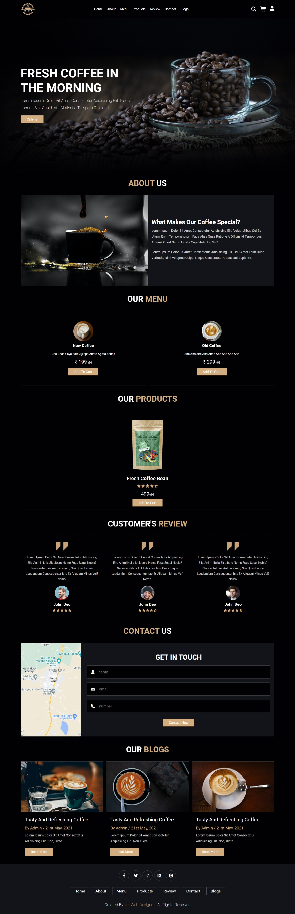
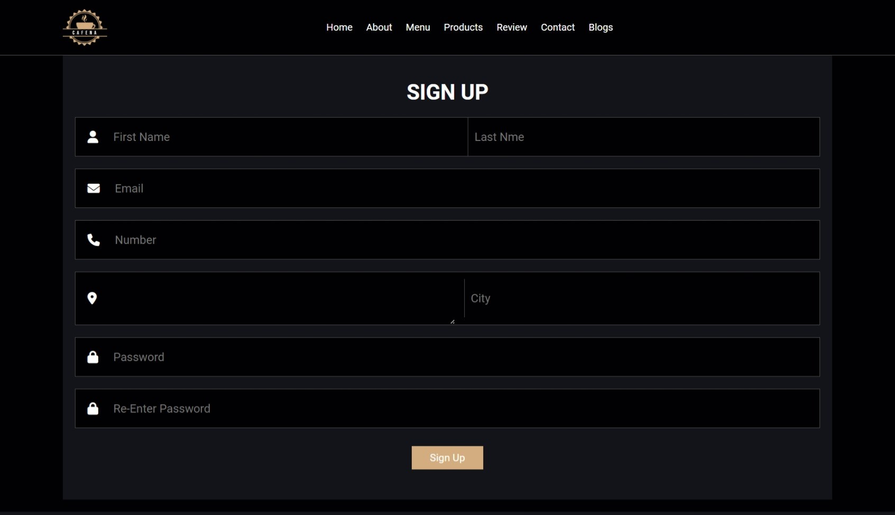
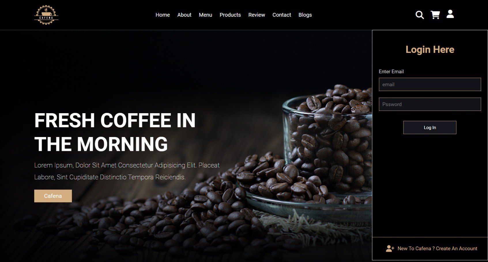
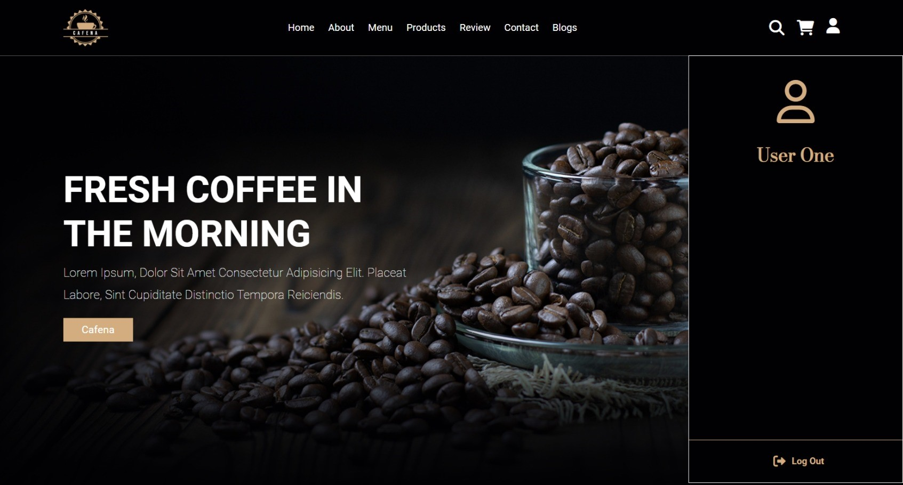
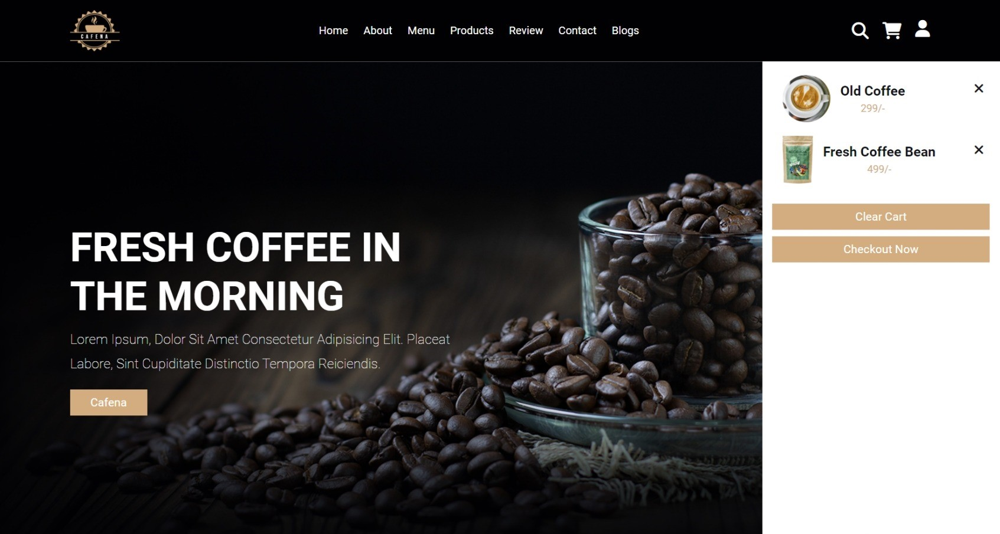

<br/>
<p align="center">
  <a href="https://github.com/omd01/Online_Coffee_Shop">
    
  </a>

  <h3 align="center">Online Coffee Shop</h3>

  <p align="center">
    The Online Coffee Shop is a web application that allows users to order coffee online. This repository contains the source code and assets required to run the web application.
    <br/>
    <br/>
    <a href="https://github.com/omd01/Online_Coffee_Shop"><strong>Explore the docs »</strong></a>
    <br/>
    <br/>
    <a href="https://github.com/omd01/Online_Coffee_Shop">View Demo</a>
    .
    <a href="https://github.com/omd01/Online_Coffee_Shop/issues">Report Bug</a>
    .
    <a href="https://github.com/omd01/Online_Coffee_Shop/issues">Request Feature</a>
  </p>
</p>

     

## Table Of Contents

* [About the Project](#about-the-project)
* [Built With](#built-with)
* [Getting Started](#getting-started)
  * [Prerequisites](#prerequisites)
  * [Installation](#installation)
* [Usage](#usage)
* [Contributing](#contributing)
* [Authors](#authors)
* [Acknowledgements](#acknowledgements)

## About The Project

* Home Screen



* SignUp Screen



* Login Screen



* User Profile Screen



* Cart Screen




* User registration and login: Users can create an account or log in to an existing account to place orders.

* Browse coffee menu: Users can view the available coffee options with their descriptions and prices.

* Add to cart: Users can add coffee items to their shopping cart.
View and edit cart: Users can view the items in their cart and modify quantities or remove items.

* Place an order: Users can place an order by providing the required details and making the payment.

* Order history: Users can view their past orders.

* Admin dashboard: An admin dashboard is provided to manage coffee products, view orders, and handle user management.

## Built With

* HTML: Used for structuring the web pages.
* CSS: Used for styling the web pages.
* PHP: Used for server-side scripting and handling form submissions.
* MySQL: Used as the database management system to store user 
  information, coffee products, and orders.

## Getting Started

This is an example of how you may give instructions on setting up your project locally.
To get a local copy up and running follow these simple example steps.

### Prerequisites

This is an example of how to list things you need to use the software and how to install them.

* XAMPP
* VS code

### Installation

1. Clone the repo

 * Imp ( Clone the repo in C:\xampp\htdocs\ )

```sh
git clone https://github.com/omd01/Online_Coffee_Shop.git
```

2. Set up the web server:

- Make sure you have a web server (such as Apache and MySQL) installed and running on your machine.
- Configure the web server to point to the root directory of the cloned repository.

4. Set up the database:

- Import the `coffee.sql` file into your MySQL server to create the necessary tables.
- Update the database connection details in the `connection.php` file to match your MySQL server configuration.


## Usage

- Open a web browser and navigate to the URL of your web server.
- Register a new account or log in to an existing account.
- Browse the coffee menu, add items to the cart, and place orders.(http://localhost/Coffee)


## Authors

* **Om Dahale** - *IT Student* - [Om Dahale](https://github.com/omd01/) - *Developed Full Project*

## Acknowledgements

* [Om Dahale](https://github.com/omd01/)
* [Online Coffee Shop](https://github.com/omd01/Online_Coffee_Shop)
* [Company (ODTECH)](https://github.com/odtech/)
